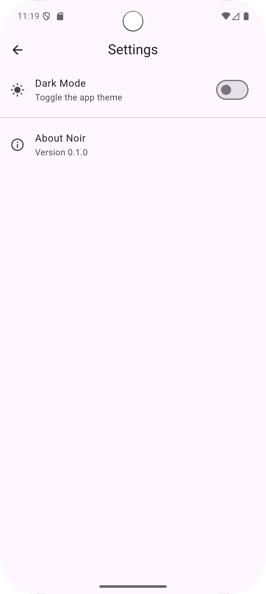

# Noir Movie App

## Overview
Noir Movie App is an innovative application designed to provide users access to a comprehensive database of film and television data, utilizing the TMDB API for fetching movie details.

<h2>Screenshots</h2>

<div style="display: flex; gap: 10px; flex-wrap: wrap; justify-content: center;">
  
  
  
  
  
  
</div>


## Features
- Browse movies by genre
- Search for movies by title
- Get detailed information about each movie

## Setup Instructions
### TMDB API Setup
1. **Sign Up** at [TMDB](https://www.themoviedb.org/signup)
2. **Create an API Key:**
   - Go to the settings page on TMDB.
   - Under the API section, create your API key.
3. **Store your API Key:**
   - Save the API key in your app's configuration file (e.g., `.env` file).

### Flutter Setup
1. **Install Flutter:**
   - Make sure you have Flutter installed. Follow the [Flutter installation guide](https://flutter.dev/docs/get-started/install) if needed.

2. **Clone the Repository:**
   ```bash
   git clone https://github.com/shebang-pixel/noir_movie_app.git
   cd noir_movie_app
   ```

3. **Get Dependencies:**
   - Run the following command to get the required packages:
   ```bash
   flutter pub get
   ```

4. **Run the Application:**
   - You can run the app on an emulator or a real device using:
   ```bash
   flutter run
   ```

## Contributing
Contributions are welcome! Feel free to submit a pull request or report issues found during your usage of the app.

## License
This project is licensed under the MIT License.
